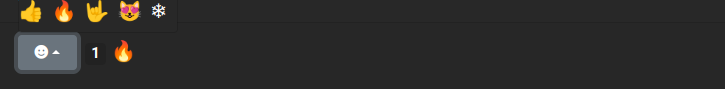

# Laravel Emoji Reactions

## v0.1a - test version



Based on Unicode emoji characters. The default list can be find in the config file.

Full unicode emojis list: https://unicode.org/emoji/charts/full-emoji-list.html

Live Demo: https://toprogram.ru/posts

Code example and usage: https://github.com/imjonos/laravel-blog

## Installation

Via Composer

``` bash
$ composer require imjonos/laravel-emoji-reaction
```

``` bash
$ php artisan vendor:publish --provider="Nos\EmojiReaction\EmojiReactionServiceProvider"
```

``` bash
$ php artisan migrate
```

## Usage

Front-end component
example https://github.com/imjonos/laravel-blog/blob/master/resources/js/components/EmojiReaction.vue

Back-end part

```
    //Model 
    
    use Nos\EmojiReaction\Interfaces\Models\EmojiReactionInterface;
    use Nos\EmojiReaction\Traits\HasEmojiReactionTrait;
    
    final class Post extends Model implements EmojiReactionInterface
    {
        use HasEmojiReactionTrait;
    ...
    
   
    // Routes
    Route::post('/posts/{post}/emoji-reactions', [\App\Http\Controllers\PostController::class, 'addEmojiReaction'])->name(
        'site.posts.add-emoji-reaction'
    );
    Route::get('/posts/{post}/emoji-reactions', [\App\Http\Controllers\PostController::class, 'getEmojiReactionStatistic']
    )->name(
        'site.posts.get-emoji-reaction-statistic'
    );
    
    //Controller
    public function getEmojiReactionStatistic(Post $post): JsonResponse
    {
        return response()->json($this->reactionStatisticService->getByModel($post));
    }

    /**
     * @throws Exception
     */
    public function addEmojiReaction(AddEmojiReactionRequest $request, Post $post): JsonResponse
    {
        $emoji = $this->emojiService->find($request->get('emoji_id'));
        abort_if(!$emoji, 400);

        DB::transaction(function () use ($post, $request, $emoji) {
            $this->reactionService->addReaction($post, $emoji);
        });

        return response()->json();
    }

```

## Contributing

Please see [contributing.md](contributing.md) for details and a todolist.

## License

license. Please see the [license file](license.md) for more information.
